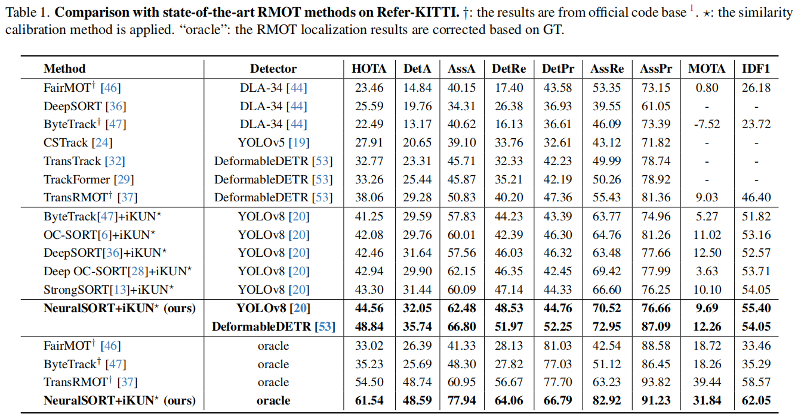

# iKUN: Speak to Trackers without Retraining


## Abstract

Referring multi-object tracking (RMOT) aims to track multiple objects based on input textual descriptions. 
Previous works realize it by simply integrating an extra textual module into multi-object tracker. 
However, they typically need to retrain the entire framework and have difficulty in optimization. 
In this work, we propose an insertable Knowledge Unification Network, termed iKUN, to enable communication with off-the-shelf trackers in a plug-and-play manner. 
Concretely, a knowledge unification module (KUM) is designed to adaptively extract visual features based on textual guidance.
To imporve the localization accuracy, we present a neural version of Kalman filter (NKF) to dynamically adjust process noise and observation noise based on the current motion status. 
Moreover, to address the problem of open-set long-tail distribution of textual descriptions, a test-time similarity calibration method is proposed to refine the confidence score with pseudo frequency. 
Extensive experiments on Refer-KITTI dataset verify the effectiveness of our framework. 
To speed up the development of RMOT, we also contribute a more challenging dataset, Refer-Dance, by extending public DanceTrack dataset with motion and dressing descriptions.

## Experiments



## Data Preparation

Download [Refer-KITTI](https://github.com/wudongming97/RMOT) and our prepared files (TBD).
Please organize them as follows:
```
path_to_data_and_files
├── CLIP
  ├── RN50.pt
  ├── ViT-B-32.pt
├── NeuralSORT
  ├── 0005
  ├── 0011
  ├── 0013
├── Refer-KITTI
  ├── gt_template
  ├── expression
  ├── KITTI
    ├── labels_with_ids
    ├── training
├── iKUN.pth
├── iKUN_cascade_attention.pth
├── iKUN_cross_correlation.pth
├── iKUN_test-first_modulation.pth
├── Refer-KITTI_labels.json
├── textual_features.json
```
Then set the default values of `--save_root` in `opts.py` to your `path_to_data_and_files`. 

You can download our constructed Refer-Dance dataset from [baidu disk](https://pan.baidu.com/s/1GxjHPt-hElb8v_c7EA1wLA?pwd=bupt).

## Requirements
- python==3.8
- torch==2.0.1
- torchvision==0.15.2
- tensorboard==2.13.0
- numpy==1.21.0
- einops==0.6.1
- ftfy==6.1.1
- regex==2023.5.5
- tqdm==4.65.0
- [clip==1.0](https://github.com/openai/CLIP)

Here is a from-scratch script:
```
conda create python=3.8.16 -n iKUN_Git --y
conda activate iKUN_Git
conda install pytorch==2.0.1 torchvision==0.15.2 torchaudio==2.0.2 pytorch-cuda=11.7 -c pytorch -c nvidia --y
pip install six==1.16.0
pip install tensorboard==2.13.0
pip install einops==0.6.1
pip install ftfy regex tqdm
pip install git+https://github.com/openai/CLIP.git # or setup from your local CLIP with `python setup.py develop`
```

## Test
For direct testing, you can run the following command to generate the results of the baseline model:
```
python test.py --test_ckpt iKUN.pth
```

To test the three designs of KUM, you can run:
```
python test.py --kum_mode 'cascade attention' --test_ckpt iKUN_cascade_attention.pth
python test.py --kum_mode 'cross correlation' --test_ckpt iKUN_cross_correlation.pth
python test.py --kum_mode 'text-first modulation' --test_ckpt iKUN_test-first_modulation.pth
```

To run the full iKUN, i.e., cascade attention & similarity calibration, please run:
```
python test.py --kum_mode 'cascade attention' --test_ckpt iKUN_cascade_attention.pth --similarity_calibration
```
Then you can evaluate the results following [official commands](https://github.com/wudongming97/RMOT),
and obtains 44.56%, 32.05%, 62.48% for HOTA, DetA, AssA, respectively.

## Train
You can run the following command to train the baseline model:
```
python train.py --exp_name my_exp
```
Then generate the test results by running:
```
python test.py --exp_name my_exp --test_ckpt 'my_exp/epoch99.pth'
```
To train the three designs of KUM, you can run:
```
python train.py --exp_name my_exp --kum_mode 'cascade attention'
python train.py --exp_name my_exp --kum_mode 'cross correlation'
python train.py --exp_name my_exp --kum_mode 'text-first modulation'
```

## Citation

TBD
